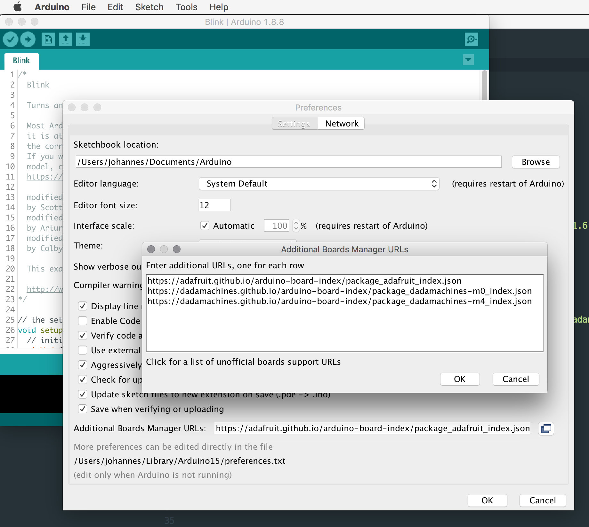
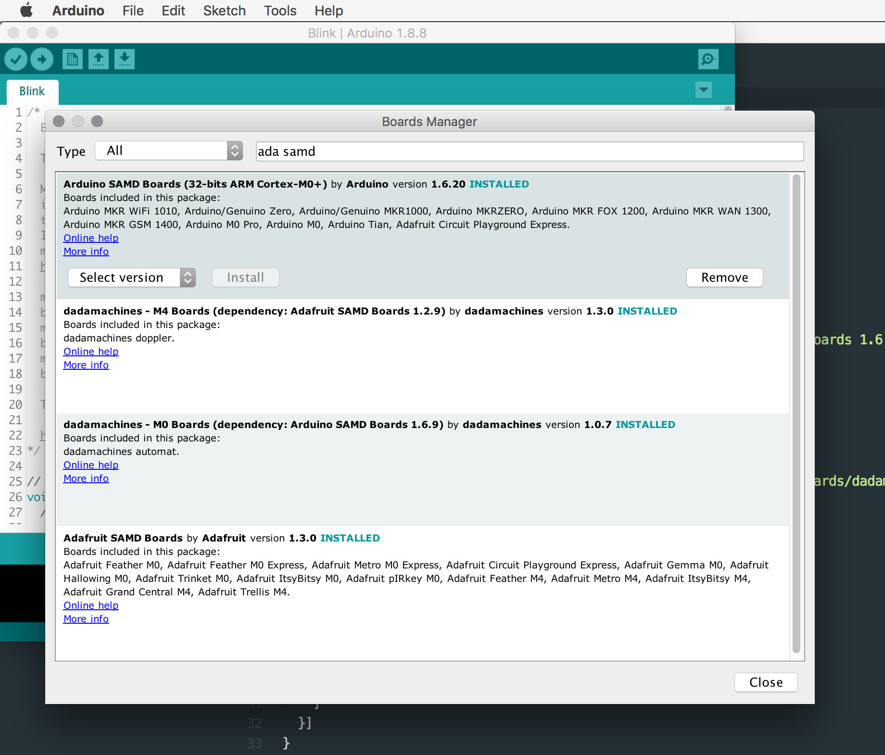

# dadamachines - Arduino Board Support Package(s)
Board Support Package(s) for Arduino IDE v1.6+.

## Installation
Add the following URL to the Arduino Boards Manager (**File->Preferences**):

1.1 For the [**automat**](https://github.com/dadamachines/automat) install the **dadamachines - M0 Boards** Package:
```
https://dadamachines.github.io/arduino-board-index/package_dadamachines-m0_index.json
```

1.2 For the [**doppler**](https://github.com/dadamachines/doppler) install the **dadamachines - M4 Boards** Package:
```
https://adafruit.github.io/arduino-board-index/package_adafruit_index.json  
https://dadamachines.github.io/arduino-board-index/package_dadamachines-m4_index.json
```



2. Then open the Arduino Boards Manager (**Tools->Boards->Boards Manager**) and install the following packages:

2.1 For the [**automat**](https://github.com/dadamachines/automat):
- **Arduino SAMD Boards (32-bits ARM Cortex-M0+)** by **Arduino**
- **dadamachines - M0 Boards** by **dadamachines**

2.2 For the [**doppler**](https://github.com/dadamachines/doppler):
- **Adafruit SAMD Boards** by **Adafruit** 
- **dadamachines - M4 Boards** by **dadamachines**



3. Restart the Arduino IDE

4. Select the **dadamachines** product / board (**Tools->Board(s)->dadamachines - M0 or M4 Boards->dadamachines "product name"**)

5. Find the official software and examples for the **dadamachines** product / board (**File->Examples->Examples for dadamachines "product name"**)

## Contribute
To report a bug, contribute, discuss usage, or simply request support, please [create an issue here](https://github.com/dadamachines/arduino-board-index/issues/new).
